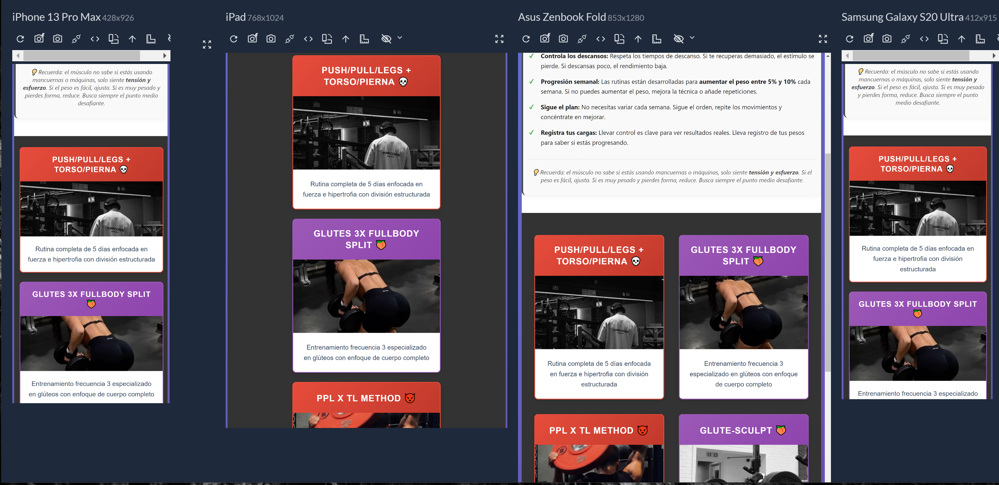
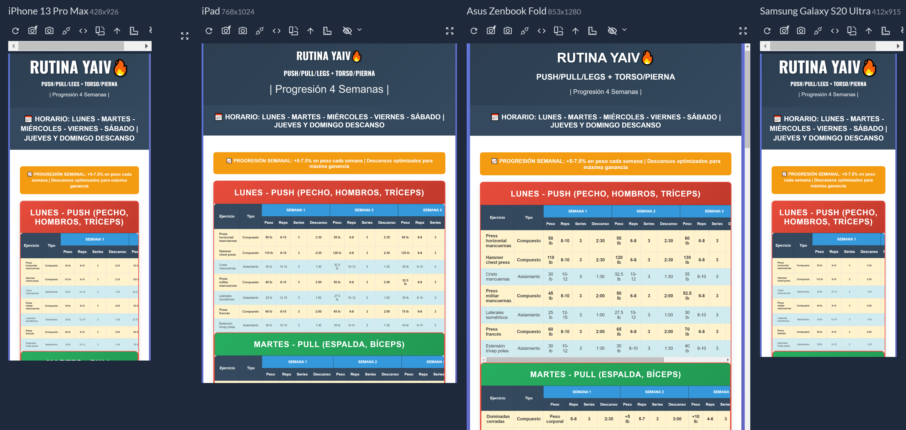

# Rutinas de Gym 💪

## Descripción del Proyecto
Este proyecto es una página web dedicada a proporcionar rutinas de entrenamiento personalizadas para diferentes tipos de usuarios. Ofrece programas de entrenamiento específicos tanto para hombres como para mujeres, con diferentes niveles y objetivos de entrenamiento.

## Características Principales
- Rutinas específicas por género
- Diferentes programas de entrenamiento:
  - Rutina Femenina
  - Rutina GxS (Gimnasio por Salud)
  - Rutina HDxTP
  - Rutina HLxU
  - Rutina TLxPPL
  - Rutina YAIV

## Estructura del Proyecto
```
yaivRutina/
├── img/                    # Directorio de imágenes
│   ├── girl1.jpg
│   ├── girl2.jpg
│   ├── gymGirl.jpg
│   ├── GymMen.jpg
│   ├── men1.jpg
│   └── men2.jpg
├── index.html             # Página principal
├── rutinaFemenina.html    # Rutina específica para mujeres
├── rutinaGxS.html        # Rutina Gimnasio por Salud
├── rutinaHDxTP.html      # Rutina específica HD por TP
├── rutinaHLxU.html       # Rutina HL por U
├── rutinaTLxPPL.html     # Rutina TL por PPL
├── rutinaYaiv.html       # Rutina YAIV personalizada
└── styles.css            # Estilos del sitio
```

## Capturas de Pantalla
### Vista Principal


### Ejemplo de Rutina


## Tecnologías Utilizadas
- HTML5
- CSS3

## Cómo Usar
1. Clona este repositorio
2. Abre `index.html` en tu navegador
3. Navega por las diferentes rutinas según tus objetivos

## Autor
Desarrollado por Yair Guerra - yaiv


